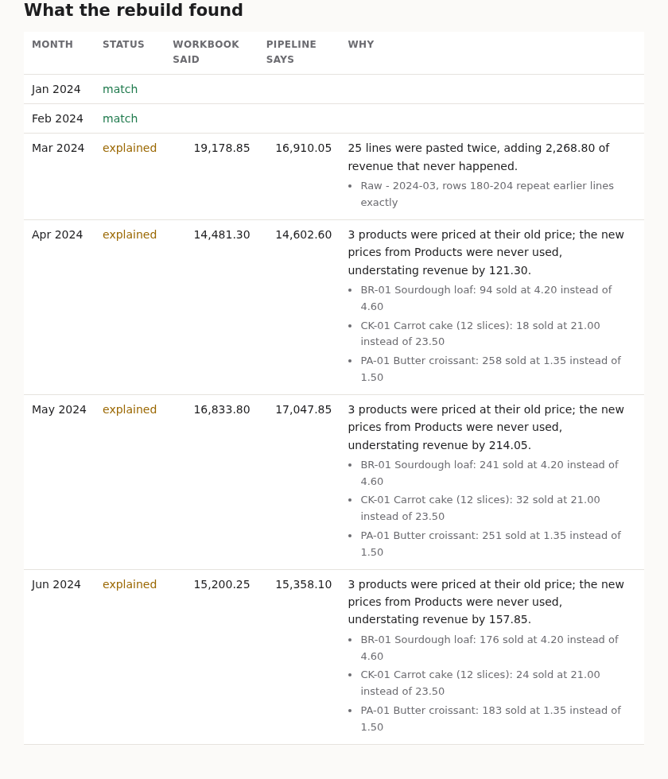

# SheetToPipeline

A small business's monthly Excel report rebuilt as a tested dbt pipeline, with a reconciliation
that proves the new numbers against the old workbook. DuckDB, dbt, openpyxl.

**Write-up and downloads: [m4dd0ck.github.io/sheet-to-pipeline](https://m4dd0ck.github.io/sheet-to-pipeline/)**
(the old workbook, the new report, and what changed)

## The job

"We run the business on this spreadsheet. Every month someone pastes the new export in and fixes
the summary by hand. Can you automate it?" This repo is that job end to end, for a fictional
wholesale bakery supplier:

| | Before | After |
|---|---|---|
| Input | order-system export pasted into a new tab | the same export, dropped in `data/incoming/` |
| Pricing | `VLOOKUP` into Products (first match wins) | price in force on the sale date |
| Totals | typed into the Summary tab | dbt mart, tested on every run |
| Output | the Summary tab | the same Summary layout, written to Excel, plus a Checks sheet |
| Effort | a monthly checklist | `s2p all` |

## What the rebuild found

Switching over is only safe if the new numbers can be trusted, so the pipeline's summary is
compared with every cell the old workbook reported. January and February match to the cent. The
other months differ, and every difference is explained exactly:



- **March was overstated by 2,268.80**: 25 lines of the export were pasted twice (rows 180-204).
- **April to June were understated by 493.20 in total**: three prices changed on 1 April and the
  new rows were added below the old ones in Products, so `VLOOKUP` kept returning the old price.

The split is exact, not estimated: the workbook's total is every pasted line at VLOOKUP's price
and the pipeline's is every real line at the correct price, so the gap decomposes line by line
into repeated lines and price differences. Anything that doesn't decompose is reported as
**unexplained** rather than hidden.

## Usage

Needs Python 3.12+ and [uv](https://github.com/astral-sh/uv).

```bash
uv sync
uv run s2p all            # build the old workbook, extract, dbt build, reconcile, report
```

One step at a time:

```bash
uv run s2p legacy         # legacy/Monthly Sales Report.xlsx - the "before"
uv run s2p extract        # raw tabs + data/incoming/*.csv -> DuckDB
uv run s2p run            # dbt build: models and tests
uv run s2p reconcile      # workbook vs pipeline, with causes
uv run s2p report         # output/Monthly Sales Report.xlsx in the old layout
```

Next month is a file, not a code change:

```bash
uv run s2p new-month 2024-07   # a sample export lands in data/incoming/2024-07.csv
uv run s2p extract && uv run s2p run && uv run s2p reconcile
```

July shows up as `new` in the reconciliation (the old workbook never had it). A month present in
both the workbook and a CSV is refused rather than counted twice.

## Models

| Model | What it does |
|-------|--------------|
| `stg_sales_lines` | every pasted line with its tab and row; exact repeats within a month flagged, not dropped |
| `stg_products` | price list with `effective_from` / `effective_to` windows |
| `stg_reps` | reps and regions |
| `fct_sales_lines` | real lines only, priced on the sale date (range join) |
| `mart_monthly_summary` | the Summary tab, column for column |

Tests fail the build if any line has no price in force, a pasted line is unaccounted for (pasted =
kept + flagged repeats, per month), the summary doesn't add up to its lines and regions, or an
invoice line appears twice.

## Project structure

```
src/sheet_to_pipeline/
├── legacy.py      # the "before" workbook, formulas and hand-kept Summary included
├── extract.py     # workbook tabs and CSV drops -> DuckDB, with row provenance
├── pipeline.py    # runs dbt
├── reconcile.py   # compare and explain
├── report.py      # Summary layout back to Excel + Checks sheet
├── site.py        # the before/after page
└── cli.py         # s2p
models/            # staging and marts
data_tests/        # line accounting, summary totals
```

The business and its data are synthetic; the workbook is generated so the whole story can be
reproduced from a clean clone.

## License

MIT
